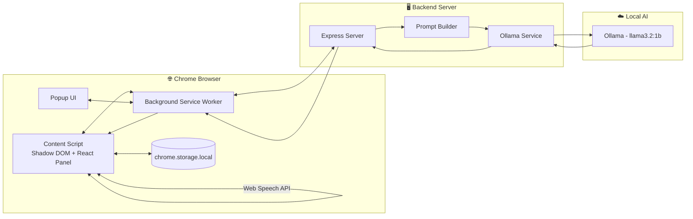

<div align="center">


<a href="#">
  
</a>

[](#-installation)
[](#-installation)
[](#-tech-stack)
[](#-tech-stack)
[](#-tech-stack)
[](#-license)

**[Demo Video](#) · [Live Screenshots](#-screenshots) · [Installation](#-installation) · [Report Bug](#)**

</div>

---

## 📖 Table of Contents

- [Overview](#-overview)
- [Problem Statement](#-problem-statement)
- [Our Solution](#-our-solution)
- [Features](#-features)
- [Screenshots](#-screenshots)
- [Demo](#-demo)
- [How It Works](#-how-it-works)
- [Architecture](#-architecture)
- [Tech Stack](#-tech-stack)
- [Folder Structure](#-folder-structure)
- [Voice Commands](#-voice-commands)
- [Installation](#-installation)
- [Environment Variables](#-environment-variables)
- [Privacy & Security](#-privacy--security)
- [Why Jarvis Is Different](#-why-jarvis-is-different)
- [Challenges We Solved](#-challenges-we-solved)
- [Future Scope](#-future-scope)
- [Contributors](#-contributors)
- [Acknowledgements](#-acknowledgements)
- [License](#-license)

---

## 🌐 Overview

**Jarvis : AI Companion** is a Manifest V3 Chrome extension that turns any webpage into a conversation. Instead of the usual "AI that knows everything but nothing about your screen," Jarvis reads **only the page you have open**, extracts the meaningful content with Mozilla's Readability engine, and lets you ask questions about it — by voice or text.

It's an evolution of an earlier vanilla-JS voice assistant (`Jarvis-With-JavaScript`), rebuilt from the ground up into a production-grade extension with a React UI, a Node/Express backend, and a **100% local, private Ollama model (llama3.2:1b)** as the reasoning engine.

> 💡 **In one line:** *Highlight less, understand more — talk to the page instead of copy-pasting it into a chatbot.*

---

## ❗ Problem Statement

Reading documentation, research papers, blogs, or source code today usually means:

- Switching tabs between the content and an AI chatbot
- Copy-pasting large chunks of text back and forth
- Losing your reading position and conversational context every time
- Sending all your reading data to cloud APIs

This constant context-switching breaks focus and slows down learning and research.

---

## ✅ Our Solution

Jarvis removes the copy-paste step entirely by living **inside the page**:

| Capability | What it gives you |
|---|---|
| 🎙️ **Voice interaction** | Ask questions and issue commands hands-free |
| 📄 **Page understanding** | Answers are grounded only in the current page's content |
| 📚 **Reading assistant** | Summarize, explain paragraphs, explain code, read aloud, translate |
| 🧠 **Conversation memory** | Per-URL chat history and reading progress, saved locally |
| 🔊 **Speech output** | Responses are read back in English or Hindi |
| 🔐 **100% Local AI** | No cloud APIs. Powered by Ollama on your own machine |

---

## ✨ Features

<table>
<tr>
<td width="50%">

**🎯 Core Assistant**
- 🎙️ Voice Commands
- 🗣️ Speech Recognition
- 🔊 Speech Synthesis
- 📝 Page Summarization
- 📖 Paragraph Explanation
- 💻 Code Explanation
- 🌐 Translation

</td>
<td width="50%">

**🏗️ Platform & Engineering**
- 🧩 Chrome Extension (MV3)
- 🌓 Shadow DOM Isolation
- ⚛️ React UI
- ✨ Ollama Local AI Backend
- 🔍 Readability Parser
- 🎨 Dark Glassmorphism UI

</td>
</tr>
<tr>
<td width="50%">

**🧠 Memory & Progress**
- 💾 Conversation Memory
- 📍 Reading Progress Tracking
- 🗂️ Per-Page Persistence

</td>
<td width="50%">

**🌍 Language & Trust**
- 🇮🇳 Hindi Support
- 🇬🇧 English Support
- 🔐 100% Offline AI Processing
- 🕵️ Privacy First — No Tracking

</td>
</tr>
</table>

---

## 📸 Screenshots

<div align="center">

| Extension Popup | Main Panel | Voice Assistant Active |
|:---:|:---:|:---:|
| *[screenshot placeholder]* | *[screenshot placeholder]* | *[screenshot placeholder]* |

| Reading Mode | Code Explanation | Conversation View | Dark Theme |
|:---:|:---:|:---:|:---:|
| *[screenshot placeholder]* | *[screenshot placeholder]* | *[screenshot placeholder]* | *[screenshot placeholder]* |

</div>

> 📌 Replace the placeholders above with actual screenshots/GIFs before submitting.

---

## 🎬 Demo

<div align="center">

| 🎞️ Demo GIF | 📹 Demo Video | 📊 Presentation | 🏗️ Architecture Doc |
|:---:|:---:|:---:|:---:|
| *[link placeholder]* | *[link placeholder]* | *[link placeholder]* | *[link placeholder]* |

</div>

---

## ⚙️ How It Works

1. **Content extraction** — `lib/extractContent.js` runs Mozilla's **Readability** against a cloned copy of the page DOM, stripping navbars, footers, ads, and cookie banners, and splitting the result into paragraphs and code blocks.
2. **Prompt building** — the extracted content, your message, and the running conversation are sent to the backend, which builds a prompt instructing the local Ollama model to answer **only from the page content** (`services/promptBuilder.js`).
3. **Persistence** — conversation history and reading progress are saved per-page-URL in `chrome.storage.local` (`shared/storage.js`), so reopening the same article resumes both the conversation and your reading position.
4. **Voice commands** — phrases like *"summarize," "read this page," "explain this paragraph," "explain this code," "continue reading," "repeat," "stop reading," "pause," "resume," "read important points," "translate this"* are matched in `lib/voiceCommands.js` and handled in `Panel.jsx`.

```mermaid
flowchart TD
    A[👤 User Opens Page] --> B[🧩 Content Script Injected]
    B --> C[📖 Mozilla Readability]
    C --> D[✂️ Extract Clean Content]
    D --> E[🔁 Background Service Worker Relay]
    E --> F[🖥️ Node/Express Backend]
    F --> G[🧠 Prompt Builder]
    G --> H[✨ Local Ollama (llama3.2:1b)]
    H --> I[💬 Response Returned]
    I --> J[🔊 Speech Synthesis + Chat UI]
```

---

## 🏗️ Architecture



**Message passing (background ↔ content script):**

- `Ctrl+Shift+J` → `chrome.commands` fires in `background.js` → `chrome.tabs.sendMessage(tabId, { type: "JARVIS_TOGGLE_PANEL" })` → `content/index.jsx` toggles the panel.
- The panel calls the backend via `chrome.runtime.sendMessage({ type: "JARVIS_API_REQUEST", path, payload })`, which `background.js` relays with `fetch()` — keeping the backend URL in one place and avoiding page-level CSP/CORS issues that a direct content-script `fetch()` could hit.

---

## 🛠️ Tech Stack

<table>
<tr><th>Category</th><th>Technologies</th></tr>
<tr><td><strong>Frontend</strong></td><td>React 18, Vite, Shadow DOM, CSS (Glassmorphism)</td></tr>
<tr><td><strong>Backend</strong></td><td>Node.js, Express</td></tr>
<tr><td><strong>AI</strong></td><td>Ollama (llama3.2:1b) running locally</td></tr>
<tr><td><strong>Chrome APIs</strong></td><td>Manifest V3, chrome.storage.local, chrome.commands, chrome.runtime, chrome.tabs</td></tr>
<tr><td><strong>Browser APIs</strong></td><td>Web Speech API (Recognition + Synthesis)</td></tr>
<tr><td><strong>Libraries</strong></td><td>Mozilla Readability</td></tr>
<tr><td><strong>Dev Tools</strong></td><td>Vite (content + popup configs), npm</td></tr>
</table>

---

## 📁 Folder Structure

```
jarvis-ai-companion/
├── extension/                      Chrome extension (Manifest V3)
│   ├── manifest.json
│   ├── background.js               Service worker: keyboard shortcut, backend relay
│   ├── icons/
│   ├── src/
│   │   ├── content/                Content script: floating button, panel, voice logic
│   │   │   ├── index.jsx             entry — Shadow DOM mount, selection toolbar
│   │   │   ├── Panel.jsx             main chat/voice UI
│   │   │   ├── content.css           dark glassmorphism theme
│   │   │   ├── components/           VoiceOrb, ChatHistory, Controls, SelectionToolbar
│   │   │   ├── hooks/                useSpeechRecognition, useSpeechSynthesis
│   │   │   └── lib/                  extractContent (Readability), api, voiceCommands
│   │   ├── popup/                  Toolbar popup (quick open + backend URL setting)
│   │   └── shared/                 chrome.storage.local helpers
│   ├── vite.content.config.js
│   ├── vite.popup.config.js
│   └── package.json
└── backend/                        Node/Express server
    ├── server.js
    ├── routes/assistant.js         /api/assistant, /api/translate, /api/health
    ├── services/ollama.js          Ollama API wrapper
    ├── services/promptBuilder.js   page-grounded prompt construction
    ├── .env.example
    └── package.json
```

---

## 🗣️ Voice Commands

| Command | Purpose | Example Phrase |
|---|---|---|
| **Summarize** | Get a summary of the current page | *"Summarize this page"* |
| **Translate** | Translate text or page to English | *"Translate this page"* |
| **Read Page** | Read the full page content aloud | *"Read this page"* |
| **Explain Paragraph** | Explain the selected/current paragraph | *"Explain this paragraph"* |
| **Explain Code** | Explain a selected code block | *"Explain this code"* |
| **Continue Reading** | Resume reading from where it stopped | *"Continue reading"* |
| **Repeat** | Repeat the last response | *"Repeat"* |
| **Pause** | Pause speech output | *"Pause"* |
| **Resume** | Resume speech output | *"Resume"* |
| **Stop Reading** | Stop speech output entirely | *"Stop reading"* |
| **Key Points** | Read out the important points only | *"Read important points"* |
| **Clarify** | Ask what something on the page means | *"What does this mean?"* |

---

## 🚀 Installation

### 1️⃣ Download Ollama

Download and install [Ollama](https://ollama.com/), then run:
```bash
ollama run llama3.2:1b
```

### 2️⃣ Backend

```bash
cd backend
npm install
npm start
# → Jarvis backend listening on http://localhost:5000
```

### 3️⃣ Extension

```bash
cd extension
npm install
npm run build
```

This produces `extension/dist/content.js`, `content.css`, and `popup.html` next to `manifest.json`.

Then, in Chrome:

1. Go to `chrome://extensions`
2. Enable **Developer mode** (top right)
3. Click **Load unpacked** and select the `extension/` folder (the one containing `manifest.json`)
4. Open any article or docs page and press **`Ctrl+Shift+J`** (or click the toolbar icon → "Open Jarvis on this page")

> ⚠️ If your backend isn't running on `http://localhost:5000`, open the toolbar popup and update the **Backend URL** field.

### 🔄 Rebuilding During Development

```bash
npm run dev:content   # rebuilds dist/content.js on change
npm run dev:popup     # rebuilds dist/popup.html on change
```

> Reload the extension from `chrome://extensions` after each content-script rebuild (Chrome doesn't hot-reload content scripts).

---

## 🔑 Environment Variables

`backend/.env` (Optional)

| Variable | Description |
|---|---|
| `OLLAMA_URL` | Ollama URL, defaults to `http://localhost:11434` |
| `OLLAMA_MODEL` | Model name, defaults to `llama3.2:1b` |
| `PORT` | Server port, defaults to `5000` |
| `CORS_ORIGIN` | Allowed origin(s), `*` for local development |

---

## 🔒 Privacy & Security

<blockquote>

🔐 **Current webpage only** — Jarvis never processes your browsing history or other tabs, only the page you're actively reading.

🧭 **No tracking** — no analytics, no telemetry, no hidden data collection.

☁️ **100% Local AI** — your data never leaves your computer. Powered by local Ollama processing.

💾 **Local storage only** — all conversation history and reading progress stay in `chrome.storage.local` on your machine.

🌓 **Shadow DOM isolation** — the floating button and panel render inside a single Shadow DOM root (`#jarvis-ai-companion-host`), so the host page's CSS can never leak in or out — safe to load on any site.

</blockquote>

---

## ⚡ Why Jarvis Is Different

| Aspect | Normal ChatGPT | Traditional Extensions | Copy-Paste Workflow | **Jarvis** |
|---|:---:|:---:|:---:|:---:|
| Understands current page | ❌ | ⚠️ Partial | ⚠️ Manual | ✅ |
| 100% Local Processing | ❌ | ❌ | ❌ | ✅ |
| Voice-first interaction | ❌ | ❌ | ❌ | ✅ |
| Reads answers aloud | ❌ | ❌ | ❌ | ✅ |
| Remembers reading progress | ❌ | ❌ | ❌ | ✅ |
| No tab-switching required | ❌ | ✅ | ❌ | ✅ |
| Isolated UI (Shadow DOM) | N/A | ❌ | N/A | ✅ |

---

## 🧩 Challenges We Solved

- **Manifest V3 constraints** — designing background logic around a non-persistent service worker
- **Shadow DOM isolation** — preventing host-page CSS/JS from leaking into or out of the panel
- **Speech recognition reliability** — handling auto-restart-on-end, Chrome silences, and user intents (listeningRef hooks)
- **Ollama Integration** — switching from a cloud API to a local model while managing context limits (llama3.2:1b)
- **Readability parsing** — cleanly extracting paragraphs and code blocks from arbitrary page structures
- **CSP & CORS** — routing all API calls through the background service worker instead of the content script
- **Conversation memory** — designing a per-URL storage schema that scales in `chrome.storage.local`

---

## 🔮 Future Scope

- 📄 PDF Reader integration
- 🔍 OCR for scanned/image-based content
- 🌍 Multi-language support beyond English/Hindi (Translation models)
- 📝 Notes & Flashcards generation
- 🎓 AI Tutor mode
- 📚 Multi-page/session summaries
- 📱 Mobile browser support
- ☁️ Cross-device browser sync

---

## 👥 Contributors

<div align="center">

| [DHYEY](https://github.com/dhyeyptl10) |
|:---:|
| 🧠 Creator & Developer |

</div>

---

## 🙏 Acknowledgements

- [Ollama](https://ollama.com/) — local AI runtime
- [Meta Llama](https://ai.meta.com/llama/) — llama3.2:1b AI model
- [Mozilla Readability](https://github.com/mozilla/readability) — content extraction
- [Chrome Extensions API](https://developer.chrome.com/docs/extensions/) — platform APIs
- [React](https://react.dev/) — UI framework
- [Node.js](https://nodejs.org/) & [Express](https://expressjs.com/) — backend runtime & server

---

## 📄 License

Licensed under the **MIT License**.

---

<div align="center">


</div>
